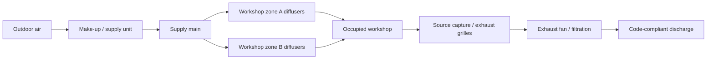

# Ventilation system schematic

This is the project-level airflow concept, not a construction drawing. Final
equipment, filtration, make-up air, pressure relationships, fire/smoke control,
and discharge locations must be selected from the actual workshop hazards and
applicable code requirements.
